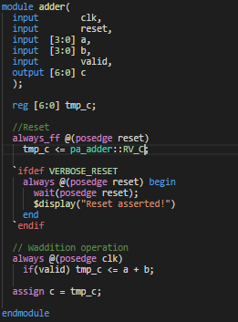
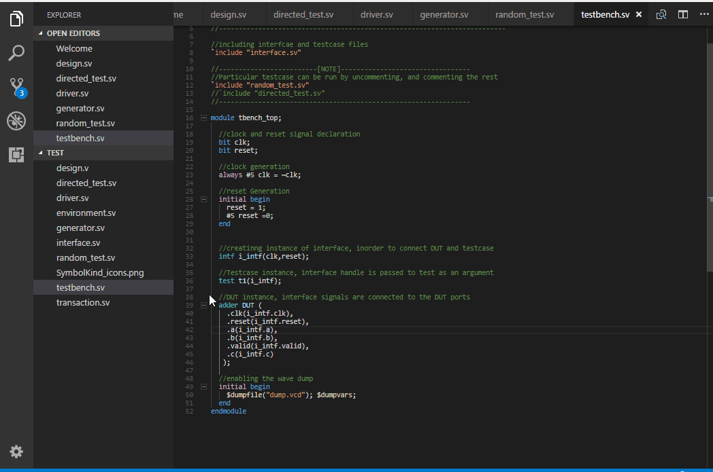
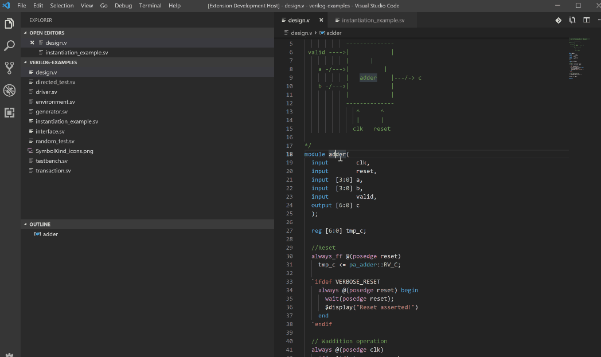

# SystemVerilog - Language Support
This VS Code extension provides features to read, navigate and write SystemVerilog code much faster.

## Features
- [Elaborate Syntax Highlighting](#examples)
- Go to symbol in document (`Ctrl+Shift+O`)
- Go to symbol in workspace folder (indexed modules/interfaces/programs/classes/packages) (`Ctrl+T`)
- Go to definition (_Works for module/interface/program/class/package names, and for ports to!_) (`Ctrl+MouseClick`)
- Quick-start on already indexed workspaces
- Code snippets for many common blocks
- Instantiate module from already indexed module
- Linter capabilites with simulators ( [More info on the wiki](https://github.com/eirikpre/VSCode-SystemVerilog/wiki) )
- Fast real-time error identification through an integrated SystemVerilog parser and IntelliSense (Fully accurate to IEEE Standard 1800-2017)
- If you find a bug, or would like a feature; Add it as an [Issue](https://github.com/eirikpre/VSCode-SystemVerilog/issues) or a [Pull-Request](https://github.com/eirikpre/VSCode-SystemVerilog/pulls)

## Examples
### Syntax Highlighting

### Go To Definition

### Module instantiation

## Recommendations
- If you have netlists in your workspace you can exclude them in the settings, Eg: `**/syn/**`
- Disclaimer: This is not a functional HDL tool that will compile and simulate your code, but this extension will make it easier and more user-friendly to write/navigate SystemVerilog and Verilog.

## Settings
- `systemverilog.includeIndexing`: _Array_, Globs defining files to be indexed.
- `systemverilog.disableIndexing`: _Boolean_, Disable indexing
- `systemverilog.excludeIndexing`: _String_, Exclude files from indexing based on glob
- `systemverilog.parallelProcessing`: _Integer_, Number of files to process in parallel during indexing
- `systemverilog.antlrVerification`: _Boolean_, Use ANTLR parser to verify code in real-time
- `systemverilog.launchConfiguration`: _String_, the command to run when launching verilator
  * Default: _verilator --sv --lint-only --language 1800-2012 --Wall_
  * If not in path, replace _verilator_ with the appropriate command
- `systemverilog.compileOnSave`: _Boolean_, compile files when saved.
  * Default: *true*
- `systemverilog.compilerType`: _String_, drop down list to select a compiler type.
  * Default: *Verilator*
- `systemverilog.trace.server`: _String_, drop down to select verbosity of LSP message tracing

## Known Issues
- Initial indexation might hog CPU/RAM when looking through files in huge workspaces
- `randcase` is not matching with `endcase` brackets properly

## Future
- Tree view of module hierarchy
- References document
- IntelliSense support (CompletionProvider)
- Back-end Language server for Systemverilog

## Release Notes
See changelog for more details
### 0.10
- Folders outside the workspace can now be included with `systemverilog.includeIndexing`
- It now saves the indexed database between runs,
allowing quickstart on previous workspaces
### 0.9
- Increased the number of symbols the parser understands.
- Extensive bug squashing
### 0.8
- Compile an opened document using `Verilator` simulator, display errors/warnings as `Diagnostics` in documents: `oehaddouchi`
- Compile documents on save feature using `Verilator` simulator
- Added output channel `SystemVerilog`
- Added an `LSP`, set it to communicate with the extension's client
- Keep track of the recently used modules in the indexer
- Added diagnostic support for `VCS` compiler
### 0.7
- Instantiate module from already indexed module, thanks to `oehaddouchi`
- Update to documentSymbolProvider
### 0.6
- Stability and performance upgrade
- PCRE Regexes
### 0.5
- HoverProvider added, thanks to `toastedcornflakes`
- Improvements to DocumentSymbolProvider to better support Hover
### 0.4
- Added setting to exclude folders from indexing
### 0.3
- DefinitionProvider fetching from indexed modules implemented
- Indexing is now more safe, and will work for large workspaces
### 0.2
- Alpha 2 release with expanded syntax highlighting and snippets
- Indexing of every module/interface/program/class in workspace
### 0.1
- Alpha 1 release with syntax highlighting, and go to symbols

