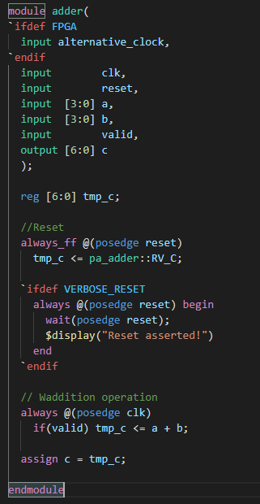
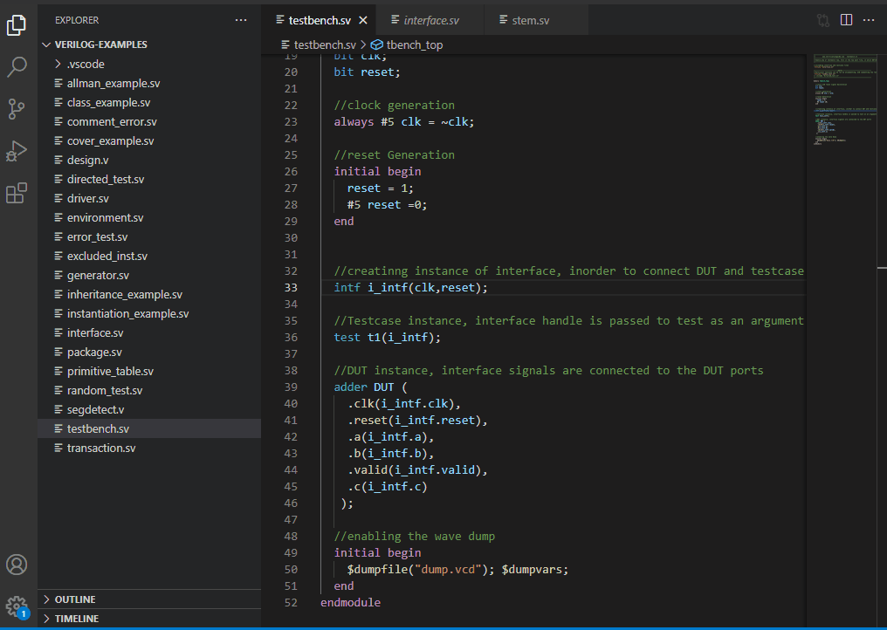
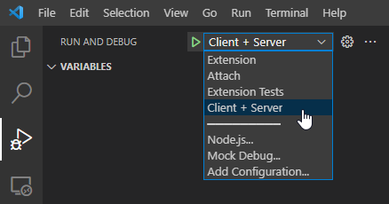

[](https://marketplace.visualstudio.com/items?itemName=eirikpre.systemverilog)
[](https://marketplace.visualstudio.com/items?itemName=eirikpre.systemverilog)

[](https://github.com/eirikpre/VSCode-SystemVerilog/actions?query=workflow%3ATest+branch%3Amaster)

# SystemVerilog - Language Support

This VS Code extension provides features to read, navigate and write SystemVerilog code much faster.

## Features

- Elaborate [syntax highlighting](#examples)
- Go to symbol in document (`Ctrl+Shift+O`)
- Go to symbol in workspace folder (indexed modules/interfaces/programs/classes/packages) (`Ctrl+T`)
- Go to definition (_works for module/interface/program/class/package names and for ports too!_) (`Ctrl+LeftClick`)
- Find references (_works for module/interface/program/class/package names and for ports too!_) (`Ctrl+LeftClick`)
- Quick-start on already indexed workspaces
- Code snippets for many common blocks
- Instantiate module from already indexed module
- Linter capabilites with simulators ([more info on the wiki](https://github.com/eirikpre/VSCode-SystemVerilog/wiki))
- Fast real-time error identification through an integrated SystemVerilog parser and IntelliSense (fully accurate to IEEE Standard 1800-2017)
- If you find a bug or would like a feature, request it as an [Issue](https://github.com/eirikpre/VSCode-SystemVerilog/issues) or submit a [Pull Request](https://github.com/eirikpre/VSCode-SystemVerilog/pulls)

## Examples

### Syntax Highlighting



### Go To Definition


### Find References



### Module Instantiation


## Recommendations

- If you have netlists in your workspace you can exclude them in the settings with `systemverilog.excludeIndexing`, e.g.: `**/syn/**`
- When running in workspaces with a large number of files, the `systemverilog.documentSymbolsPrecision` setting may need to be reduced down to 'full_no_references'. Doing this will turn off the 'find references' feature which will dramatically speedup the parsing.
- When you have large files, the `systemverilog.maxLineCountIndexing` setting can be tuned to prevent full parsing of these files, which will improve extension performance.
- _Disclaimer_: This is not a functional tool that will compile and simulate HDL, but it will make it easier and more user-friendly to write and navigate SystemVerilog and Verilog.

## Settings

- `systemverilog.includeIndexing`: _Array_, Files included for indexing (glob pattern). Examples:
  - Include files within the workspace's rtl folder (`*` at front of pattern denotes path is relative to workspace root): `**/rtl/**/*.{sv,v,svh,vh}`
  - Add all files with a '.svp' extension: `**/*.svp`
  - Add files only when in a specific workspace: `/abs/path/to/workspace/rtl/**/*.{sv,v,svh,vh}`
- `systemverilog.disableIndexing`: _Boolean_, Disable indexing
- `systemverilog.excludeIndexing`: _String_, Exclude files from indexing based on glob
- `systemverilog.forceFastIndexing`: _Boolean_, Use fast regular expression parsing
- `systemverilog.enableIncrementalIndexing`: _Boolean_, Enable incremental indexation as files are opened
- `systemverilog.parallelProcessing`: _Integer_, Number of files to process in parallel during indexing
- `systemverilog.forceFastIndexing`: _Boolean_, force indexer to bo basic parsing. Good for when the extension takes too long to initialize.
- `systemverilog.enableIncrementalIndexing`: _Boolean_, Enable incremental indexation as you open files.
- `systemverilog.maxLineCountIndexing`: _Boolean_, When indexing a file, if the line count is larger than this number, _fast_ indexing will be used to improve symbol lookup performance, as fewer symbols will be parsed.
- `systemverilog.documentSymbolsPrecision`: _String_, The level of detail the parser should use when looking for symbols:
  - _full_: detect blocks, ports, parameters, classes, methods, typedefs, defines, labels, instantiations, assertions, and _references across files_.
  - _full_no_references_: detect blocks, ports, parameters, classes, methods, typedefs, defines, labels, instantiations, and assertions.
  - _declarations_: detect blocks, ports, parameters, classes, methods, typedefs, and defines.
  - _fast_: detect only common blocks (module, class, interface, package, program) without hierarchy.
- `systemverilog.antlrVerification`: _Boolean_, Use ANTLR parser to verify code in real-time
- `systemverilog.verifyOnOpen`: _Boolean_, Run ANTLR verification on all files when opened.
- `systemverilog.launchConfigurationVerilator`: _String_, Command to run when launching verilator
  - Default: _verilator --sv --lint-only --language 1800-2012 --Wall_
  - If not in path, replace _verilator_ with the appropriate command
- `systemverilog.launchConfigurationVCS`: _String_, Command to run when launching VCS
  - Default: _vcs_
  - If not in path, replace _vcs_ with the appropriate command
- `systemverilog.launchConfigurationVerible`: _String_, Command to run when launching Verible
  - Default: _verible-verilog-lint_
  - If not in path, replace _verible-verilog-lint_ with the appropriate command
- `systemverilog.excludeCompiling`: _String_, Files excluded from compiling when saved based on glob
- `systemverilog.compileOnSave`: _Boolean_, Compile files when saved
  - Default: `true`
- `systemverilog.compilerType`: _String_, Dropdown list to select a compiler type
  - Default: `Verilator`
- `systemverilog.trace.server`: _String_, Dropdown to select verbosity of LSP message tracing
- `systemverilog.compileOnOpen`: _Boolean_, Compile all files when opened
  - Default: `false`

### Customizations

Use the provided settings in a user or workspace `settings.json` as appropriate. Here are a few examples:

```json
{
  "editor.bracketPairColorization.enabled": true, // turn on bracket pair coloring
  "editor.guides.bracketPairs": "active", // turn on bracket pair guides
  // Change theme default colors for specific tokens
  // To find tokens use: https://code.visualstudio.com/api/language-extensions/syntax-highlight-guide#scope-inspector
  "editor.tokenColorCustomizations": {
    // Customize per theme or globally
    "[Theme Name]": {
      "textMateRules": [
        {
          // Workaround: Extension marks escaped identifiers as regular expressions to prevent bracket matching,
          //             so recoloring it back to identifier color
          "scope": ["string.regexp.identifier.systemverilog"],
          "settings": {
            "foreground": "#e06c75"
          }
        }
      ]
    }
  },
  // Customize formatting command to suite preferences
  "systemverilog.formatCommand": "verible-verilog-format --assignment_statement_alignment=preserve --case_items_alignment=infer --class_member_variables_alignment=infer --formal_parameters_alignment=preserve --formal_parameters_indentation=indent --named_parameter_alignment=flush-left --named_parameter_indentation=indent --named_port_alignment=flush-left --named_port_indentation=indent --net_variable_alignment=preserve --port_declarations_alignment=preserve --port_declarations_indentation=indent",
  // Add additional file extensions to associate with SystemVerilog and include them in the indexing
  "files.associations": {
    "*.svi": "systemverilog",
    "*.svp": "systemverilog",
    "*.pkg": "systemverilog"
  },
  "systemverilog.includeIndexing": ["**/*.{sv,v,svh,vh,svi,svp,pkg}"]
}
```

## Known Issues

- Initial indexing might hog CPU/RAM when looking through files in very large workspaces

## Future

- Tree view of module hierarchy
- References document
- Back-end Language server for SystemVerilog
- Update workspace state to save to [storagePath](https://code.visualstudio.com/api/advanced-topics/remote-extensions#persisting-extension-data-or-state)

## Contributing

- If you want to contribute with the project please fork this repository, clone it, make changes (preferably in a branch other than master) and finally create a Pull Request (more details [here](https://guides.github.com/activities/forking/)).
- To debug the extension locally first install the required dependencies (in the repository's root directory):

```bash
npm install
```

- Then compile the project at least once (this will generate the SystemVerilog lexer and parser in `src\compiling\ANTLR\grammar\build`):

```bash
npm run compile
```

- Finally, run the "Client + Server" run configuration:



## Release Notes

See the [changelog](CHANGELOG.md) for more details

### 0.13.2

- modified formatter command parser to support windows paths by `joecrop`
- module instantiator now detects parameters correctly by `joecrop`

### 0.13.1

- Improved remote ssh performance by `eirikpre`

### 0.13

- input/output/input now have different icons in the outline tree by `joecrop`
- Format module instance and dropdown list of modules for auto-instantiator by `joecrop`
- support more file extensions and no extension in antlr parser by `joecrop`
- Bump minimist from 1.2.5 to 1.2.6 by `dependabot`
- Include indexing docs by `joecrop`

### 0.12.1

- Update VS Code engine to 1.56.0 to support Node.js 14
- Update several dependencies to address CVEs
- Update ESLint to version 8 and implement some suggested fixes
- Update Prettier and apply suggested formatting changes
- Remove React-related ESLint dependencies
- Remove direct dependency on `antlr4` package as it is a submodule of `antlr4ts`
- Remove on Markdown activation
- Rename `.eslintrc` to `.eslintrc.json` to fix ESLint editor integration
- Add `-Xexact-output-dir` to compile command to fix MacOS build
- Update `README.md` with a suggested configuration section and add missing settings
- Enable bracket matching and coloring to function with SystemVerilog textual brackets
- Fix `port-net-parameter` highlighting corner case
- Enhance Github Actions test workflow
- Fix coverage collection

### 0.12

- Implemented 'find references' feature, thanks to `joecrop`
- Ports and parameters are now recognized as symbols, thanks to `joecrop`
- Illegal/reserved words contained with symbols is now supported, thanks to `joecrop`
- Added more consistent syntax highlighting for UDP tables, thanks to `sw23`
- Added support for verible_verilog_lint as a compiler/linter, thanks to `joecrop`
- Fixed 'npm run compile' on MacOS, thanks to `sw23`
- Added 'Contributing' section to documentation, thanks to `gasrodriguez`

### 0.11

- Syntax Highlighting Overhaul, thanks to `jecassis`
- Smaller extension footprint, thanks to `jecassis`
- Support for external formatter, thanks to `jecassis`
- Documentation upgrade, thanks to `jecassis`
- Dev update with ESLint, Prettier and tests update, thanks to `jecassis`

### 0.10

- Folders outside the workspace can now be included with `systemverilog.includeIndexing`
- It now saves the indexed database between runs, allowing quickstart on previous workspaces

### 0.9

- Increased the number of symbols the parser understands.
- Extensive bug squashing

### 0.8

- Compile an opened document using `Verilator` simulator, display errors/warnings as `Diagnostics` in documents, thanks to `oehaddouchi`
- Compile documents on save feature using `Verilator` simulator
- Added output channel `SystemVerilog`
- Added an `LSP`, set it to communicate with the extension's client
- Keep track of the recently used modules in the indexer
- Added diagnostic support for `VCS` compiler

### 0.7

- Instantiate module from already indexed module, thanks to `oehaddouchi`
- Update to documentSymbolProvider

### 0.6

- Stability and performance upgrade
- PCRE Regexes

### 0.5

- HoverProvider added, thanks to `toastedcornflakes`
- Improvements to DocumentSymbolProvider to better support Hover

### 0.4

- Added setting to exclude folders from indexing

### 0.3

- DefinitionProvider fetching from indexed modules implemented
- Indexing is now more safe, and will work for large workspaces

### 0.2

- Alpha 2 release with expanded syntax highlighting and snippets
- Indexing of every module/interface/program/class in workspace

### 0.1

- Alpha 1 release with syntax highlighting, and go to symbols
